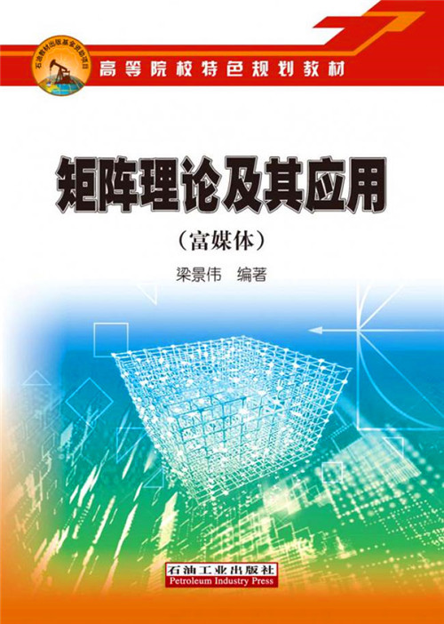

# 教材
本repository解答的是本人母校——中国石油大学（北京）梁景伟老师出版的《矩阵理论及其应用（富媒体）》

    

# 初衷
本repository以每周作业的形式，完成对该教程**部分习题**的解答。

通过repository的形式有如下四点原因：
- 动手实践有利于加深自己对矩阵理论的理解
- 提升Markdown编写能力
- 提升MATLAB程序编写能力
- 提升GitHub使用能力

鄙人能力有限，解答中难免会有错误，望多多包涵。

如果觉得我的这个repository有用，还请您star本repository。

任何有关习题解答错误或者有更好的建议都可以提交issue或者通过本人邮箱(chenxiuyan_t@163.com)联系我。

# 解答形式

在homeword文件夹里面会以week_x(x代表周数)为每周作业文件夹，里面包含.md源码(markdown文件夹)，MATLAB源码(matlab_code文件夹)的形式每周更新上一周的作业。

同时在下一周我会在个人的[CSDN博客](https://blog.csdn.net/qq_32614873?spm=1000.2115.3001.5343)上发布习题解答的博客。

# 其他
homeword.md里面是每周作业的照片，方便查找作业。

在homeword/week_1中有个名叫"latex(弃用)"的文件夹, 这是最开始探索latex去写作时留下的文件，但是发现markdown更好用，就弃用了latex，保留在这作为后面个人学习使用。

