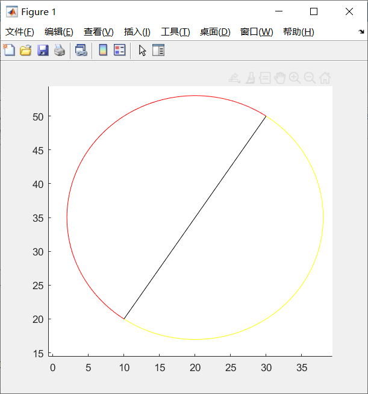

>- 姓名:陈修言
>- 学号:2021211223
>- 班级:信息研21-1
>- 科目:矩阵理论

## **题1.1**

证明:

由题意知，三个点A,B,C对应坐标为：$A(x_i, y_i, z_i)$, $B(x_j, y_j, z_j)$, $C(x_k, y_k, z_k)$,
所以向量$\overrightarrow{AB} = (x_j-x_i, y_j-y_i, z_j-z_i)$, 向量$\overrightarrow{AC} = (x_k-x_i, y_k-y_i, z_k-z_i)$。由公式可知，由ABC三点组成的三角形面级$S = \frac{1}{2}\left|\overrightarrow{AB} \times \overrightarrow{AC} \right|$。

$$
    \text{而}\begin{gathered}
        \overrightarrow{AB} \times \overrightarrow{AC} =
        \left|\begin{matrix}
            i       & j       & k       \\
            x_j-x_i & y_j-y_i & z_j-z_i \\
            x_k-x_i & y_k-y_i & z_k-z_i
        \end{matrix} \right |
    \end{gathered}
$$

$$
    = i* \begin{vmatrix}
        y_j-y_i & z_j-z_i \\
        y_k-y_i & z_k-y_k
    \end{vmatrix} - j* \begin{vmatrix}
        x_j-x_i & z_j-z_i \\
        x_k-x_i & z_k-z_i
    \end{vmatrix} + k * \begin{vmatrix}
        x_j-x_i & y_j-y_i \\
        x_k-x_i & y_k-y_i
    \end{vmatrix}
$$

$$
    \therefore |\overrightarrow{AB}\times\overrightarrow{AC}| =
$$

$$
    \sqrt{(i^2) * \begin{vmatrix}
            y_j-y_i & z_j-z_i \\
            y_k-y_i & z_k-y_k
        \end{vmatrix} ^2 + (-j)^2 * \begin{vmatrix}
            x_j-x_i & z_j-z_i \\
            x_k-x_i & z_k-z_i
        \end{vmatrix} ^2 + (k^2) * \begin{vmatrix}
            x_j-x_i & y_j-y_i \\
            x_k-x_i & y_k-y_i
        \end{vmatrix}^2}
$$

$$
    = \sqrt{\begin{vmatrix}
            y_j-y_i & z_j-z_i \\
            y_k-y_i & z_k-y_k
        \end{vmatrix} ^2 + \begin{vmatrix}
            x_j-x_i & z_j-z_i \\
            x_k-x_i & z_k-z_i
        \end{vmatrix} ^2 + \begin{vmatrix}
            x_j-x_i & y_j-y_i \\
            x_k-x_i & y_k-y_i
        \end{vmatrix}^2}
$$

证毕！

## **题1.2**

由于二阶行列式的值为行/列向量所组成平行四边形的有向面积，所以可以通过判断已知线段和另一个点组成的两个向量之间平行四边形的有向面积，如果为正，表示另一个点在已知线段的逆时针方向，即左方，如果为负则为顺时针方向，即右方，如果为0则与已知线段共线。

**MATLAB代码如下：**

```matlab
function area = triArea(point1, point2, point3)
%triArea - Description
% input three points, to calculate the triangle surrounded by those points

% Syntax: area = triArea(point1, point2, point3)

A = [1,point1; 
1,point2;
1,point3 ];

area = det(A);
    
end
```


```matlab
% give 2 points as known line, and input another 
% point to judge the position relative the known line.

point1 = [10,20];
point2 = [30,50];

point3_x = input('input the x of new point:');
point3_y = input('input the y of new point:');

point3 = [point3_x, point3_y];

area = triArea(point1, point2, point3);

hold on;
plot([point1(1), point2(1)], [point1(2), point2(2)]);
plot([point1(1), point3(1)], [point1(2), point3(2)]);
plot(point3_x, point3_y,'r>');


if (area == 0)
    text(point3_x, point3_y, '共线');
elseif (area > 0)
    text(point3_x, point3_y, '左方');
else
    text(point3_x, point3_y, '右方');
end
```

<center>


</center>


## **题1.3**

可以通过求解得到已知线段与x轴的夹角$\theta$(正数)，通过遍历圆心的角度去画圆，范围$[\theta, \theta+180°]$的为左半圆，用红色线条表示，范围$(\theta+180°,\theta+360°)$的为右半圆，用黄色线条表示。

**MATLAB代码如下:**

```matlab
clear;clc;

point1 = [10,20];
point2 = [30,50];

center = point1/2 + point2/2;
r = sqrt((center(1)-point1(1))^2 + (center(2)-point1(2))^2);

theta = abs(atan((point2(2)-point1(2))/(point2(1)-point1(1))));

% 左半圆
theta_add = linspace(0,pi) + theta; 

x = r*cos(theta_add) + center(1);
y = r*sin(theta_add) + center(2);

hold on;
plot(x, y, 'r');

% 右半圆
theta_add = linspace(pi,2*pi) + theta; 

x = r*cos(theta_add) + center(1);
y = r*sin(theta_add) + center(2);

hold on;
plot(x, y, 'y');

plot([point1(1), point2(1)], [point1(2), point2(2)], 'black');

```

<center>
    
</center>

## **题1.4**

判断两条直线是否相交，并求出交点，思路如下：
- 先通过题1.2中的方法，判断某一条直线的两个点相对于另一条直线的位置。
- 如果位置相同，则表示不相交。对于相交的情况，首先求解出两个线段所在直线对应函数表达式，即$a*x + b = y$， 然后将两个方程联立求解，求解可用matlab矩阵求解方式直接解出答案。
- 如果位置不同，不一定是不相交，可能存在某条线段的延长线和另一条线段相交的情况，这种情况先拟计算出交点，判断交点是否在两条线段上来判断是否相交。

**MATLAB代码如下：**

```matlab
clear;clc;

% line1
p1 = [10,20];
p2 = [-20,50];
% line2
p3 = [5,40];
p4 = [20,23];

area1 = triArea(p1,p2,p3);
area2 = triArea(p1,p2,p4);

hold on;
plot([p1(1),p2(1)],[p1(2),p2(2)],'r');
plot([p3(1),p4(1)],[p3(2),p4(2)],'y');


if ((area1>0 && area2>0) || (area1<0 && area2<0))
    
    text(p1(1),p1(2), 'No cross point!');
else
    
    %solve two lines' equation a*x + b = y
    A_eq1 = [p1(1),1;p2(1),1];
    B_eq1 = [p1(2);p2(2)];
    eq1 = A_eq1\B_eq1;

    A_eq2 = [p3(1),1;p4(1),1];
    B_eq2 = [p3(2);p4(2)];
    eq2 = A_eq2\B_eq2;
    
    A = [eq1(1),-1;eq2(1),-1];
    B = [-eq1(2);-eq2(2)];
    
    cross_point = A\B;
    
    % check whether the cross_point both on two lines
    len_in_p12 = sqrt(((cross_point(1)-p1(1))^2) + ((cross_point(2)-p1(2))^2))...
        + sqrt(((cross_point(1)-p2(1))^2) + ((cross_point(2)-p2(2))^2));
    
    len_in_p34 = sqrt(((cross_point(1)-p3(1))^2) + ((cross_point(2)-p3(2))^2))...
        + sqrt(((cross_point(1)-p4(1))^2) + ((cross_point(2)-p4(2))^2));
    
    len_p12 = sqrt(((p2(1)-p1(1))^2) + ((p2(2)-p1(2))^2));
    len_p34 = sqrt(((p4(1)-p3(1))^2) + ((p4(2)-p3(2))^2));
    
    % for double can't compare directly
    eps = 1e-10;
    
    if (abs(len_p12-len_in_p12)<eps && abs(len_p34-len_in_p34)<eps)
        plot(cross_point(1), cross_point(2), 'r>');
    
        text(cross_point(1)+0.5, cross_point(2)+0.5, [string(cross_point(1)),string(cross_point(2))]);
    else
        text(p1(1),p1(2), 'No cross point!');
    end
end
```

<center>
    
    
    
</center>